# KohakuFA

### Flash attention for Blackwell, with gradients you can trust

**KohakuFA** is a flash attention implementation for NVIDIA Blackwell (sm_100+) written in
[Gluon](https://github.com/triton-lang/triton) (Triton's tile-level dialect): tcgen05 tensor-core
MMAs into tensor memory, TMA, warp specialization. It does dense, token-causal and
**block-causal** attention (frames of `P` tokens that see their own and earlier frames, with
hidden tiles never loaded), and it keeps the **backward exact where other flash kernels silently
break**: once an attention layer learns near-one-hot attention and its logits grow past ~1e5,
FlashAttention-4, cuDNN and PyTorch's memory-efficient kernel return gradients that are wrong by
10x to 1000x (or `inf`), while the forward and the loss look perfectly normal. KohakuFA's fp16
gradients stay at the fp16 rounding floor there, as close to fp64 as FlashAttention-2.

The short version of what this repository found: **"fp16 training is unstable" was not fp16's
fault, it was the attention kernel's.** The details are in [docs/precision.md](docs/precision.md).

**You can check it on a stock model.** Fine-tune the pretrained DINOv3 ViT-B/16 from the Hugging
Face Hub on a toy task and recompute each layer's attention backward with every kernel against
fp64 (`benchmarks/dinov3_backward.py`). Worst layer's dK relative error, before any training step:

| | cuDNN (PyTorch SDPA) | FlashAttention-4 | **KohakuFA** | correct-kernel floor |
|---|---|---|---|---|
| fp16 | 5.4e-2 (25x floor) | 5.5e-2 (26x) | **2.2e-3 (1.0x)** | 2.1e-3 |
| bf16 | 5.0e-1 (54x floor) | 5.0e-1 (54x) | **9.5e-3 (1.0x)** | 9.3e-3 |

**Flex attention has the same bug, depending on sequence length.** A community member hit
large-logit, wrong-gradient behaviour with PyTorch flex attention on an RTX PRO 6000 (cuDNN 9.10,
logits above 3e5); we reproduced it on B300 (cuDNN 9.20). dQ relative error vs fp64, logits
~1.2e5 (`torch.compile(flex_attention)`, dense):

| sequence length | 256 | 257 | 261 | 1000 | 1024 | 1029 | 4096 | 4100 |
|---|---|---|---|---|---|---|---|---|
| fp16 flex attention | **7.0e-2** | 6.0e-3 | 4.8e-3 | 7.4e-3 | **7.2e-2** | 6.9e-3 | **5.9e-2** | 6.2e-3 |
| fp16 cuDNN (SDPA) | 7.1e-2 | 7.7e-2 | 4.9e-2 | 8.3e-2 | 7.2e-2 | 6.4e-2 | 5.9e-2 | 5.6e-2 |
| fp16 **KohakuFA** | **5.5e-3** | **5.4e-3** | **5.0e-3** | **7.4e-3** | **5.9e-3** | **6.1e-3** | **5.1e-3** | **4.8e-3** |
| bf16 flex attention | **3.0** | 2.5e-2 | 2.0e-2 | 3.3e-2 | **7.3e-1** | 2.7e-2 | **6.1e-1** | 3.7e-2 |
| bf16 cuDNN (SDPA) | 3.0 | 5.4e-1 | 5.5e-1 | 6.7e-1 | 7.3e-1 | 5.7e-1 | 6.1e-1 | 6.1e-1 |
| bf16 **KohakuFA** | **1.4e-1** | **2.2e-2** | **1.8e-2** | **3.5e-2** | **3.5e-2** | **2.9e-2** | **3.8e-2** | **3.8e-2** |

Flex fails exactly when the sequence length is a multiple of its 128-token block (256, 1024,
4096: the same error as cuDNN) and is accurate at every other length (257, 261, 1000, 1029,
4100), so the bug lives in the kernel path it selects for divisible lengths (its `IS_DIVISIBLE`
fast path). Causal and key-padding masks show the same pattern (S=1024 causal: flex 8.5e-2).
cuDNN is wrong at every length; KohakuFA is accurate at every length.

and through 20k fine-tuning steps, in fp16 and bf16 (bf16 does not hide the bug; it makes it
larger):

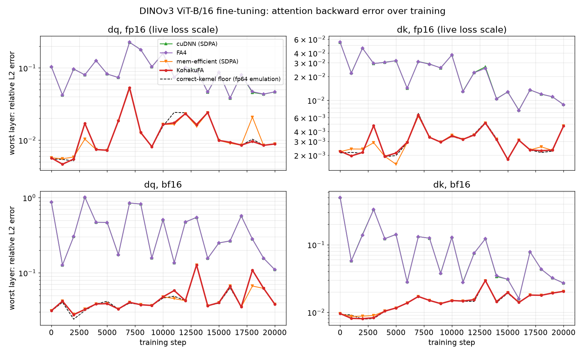

In a real fp16 video-model run these bugs decorrelated the trunk's gradients from the truth
(cosine 0.01) and made the gradient norm creep up 10x; see [Precision](#precision).

### Why the gradients go wrong, and how KohakuFA fixes it

Flash attention never stores the attention matrix: the backward **recomputes** the softmax
probabilities `P` from the scores and a few numbers saved per query row. Pretrained ViTs learn
near-one-hot attention in some layers (DINOv3's first layers reach logits of 1e5 out of the box,
and training pushes them higher), and at those magnitudes fp32 has few bits left after the
decimal point, so *how* those per-row numbers are kept and combined decides whether the
recomputed `P` is right. A slip there is invisible in the forward (the output and the loss look
fine) but is amplified in the backward, whose `dS = P * (dP - delta)` is a difference of nearly
equal terms in exactly those rows.

Notation, per query row (`*` is elementwise or scalar multiplication, `@` a matrix product,
`log2` / `exp2` are functions):

* `S = Q @ K^T`: the raw scores; `scale = 1 / sqrt(D)`; `c = scale * log2(e)`, so the
  softmax is computed with `exp2`
* `m = max(S)`: the row max; `l = sum(exp2(c * (S - m)))`: the row sum
* `P = exp2(c * (S - m)) / l`, `O = P @ V`
* backward: `dP = dO @ V^T`, `delta = rowsum(dO * O)`, `dS = P * (dP - delta)`,
  `dQ = scale * (dS @ K)`, `dK = scale * (dS^T @ Q)`, `dV = P^T @ dO`

| | what goes wrong | effect | seen in | KohakuFA's fix |
|---|---|---|---|---|
| 1 | the row max and row sum are saved as **one** fp32 number, `lse = c * m + log2(l)`; at large `c * m`, fp32 rounds `log2(l)` away | the recomputed `P = exp2(c * S - lse)` no longer sums to 1: dV wrong directly, dQ / dK blow up | FA4, cuDNN, mem-efficient, flex | keep `m` and `log2(l)` as two numbers: `P = exp2(c * (S - m) - log2(l))` |
| 2 | the exponent is `fma(S, c, -(c * m))` = `S * c - c * m`, scale before shift: `c * m` is rounded to fp32, so the row's largest `P` is `2^(rounding residual)` instead of exactly 1 | `O` carries that rounding error, so `delta = rowsum(dO * O)` stops cancelling `dP`: dQ / dK wrong, **worse in bf16** | FA4, cuDNN; flex in a milder form (it computes `S * c` for every score before subtracting the max, so near-tied large logits lose their difference) | shift first, `(S - m) * c`: `S - m` is exact near the max, the largest `P` is exactly 1 |
| 3 | `scale * dS` is rounded to fp16 (the operand of the dQ / dK matmuls) instead of `dS` | `log2(1 / scale)` bits of range lost to underflow (3 at head dim 64); grows as gradients shrink under a moderate loss scale | cuDNN, mem-efficient | round `dS` to fp16; multiply by `scale` on the fp32 dQ / dK accumulators |

Bugs 1 and 2 come from fp32 arithmetic inside the kernel, so they hit bf16 as hard as fp16 (bug 2
harder); only bug 3 is fp16-specific. The fixes cost about 5% of attention time (one extra fp32
operation per score). Full derivations, code and measurements: [docs/precision.md](docs/precision.md).

```python
from kohakufa import attention, attention_varlen, pack_mask

out = attention(q, k, v)                     # dense,  q / k / v [B, H, S, D]
out = attention(q, k, v, causal=True)        # token causal
out = attention(q, k, v, block_causal=256)   # frame-causal: frames of 256 tokens
out = attention(q, k, v, mask=mask)          # any boolean mask, True = visible
packed = pack_mask(mask, B, H, Sq, Skv)      # pack once, reuse across layers / calls

# packed variable-length sequences: q [Tq, H, D], k / v [Tk, Hkv, D]
out = attention_varlen(q, k, v, cu_seqlens_q, cu_seqlens_k, causal=True)
```

---

## Why this library

* **Correct backward at large logits.** Three precision bugs in FlashAttention-4, cuDNN, flex
  attention and PyTorch's memory-efficient kernel (a single fp32 log-sum-exp per row, scaling the
  scores before shifting them, rounding `scale * dS` instead of `dS` to fp16) are fixed here.
  Two of them hit bf16 as well, one harder; see [the precision results](#precision) and
  [stock DINOv3](#on-stock-dinov3-from-the-hub-in-fp16-and-bf16).
* **Block-causal attention as a first-class mode.** Video and streaming models attend causally
  over *frames*, not tokens. KohakuFA classifies every tile as hidden / fully visible / boundary,
  never loads hidden tiles, and only masks boundary tiles: up to **4.7x** faster than
  FlashAttention-2 running the equivalent dense attention, where cuDNN with a mask is *slower*
  than FA2.
* **Fast at the sizes models actually use.** Dense attention at short and medium sequence lengths
  (256 to 2k tokens per head: ViT patches, diffusion-transformer tokens, cross-attention) is
  where KohakuFA leads, thanks to paired query tails and narrow tail tiles that cut the waste of
  non-power-of-two lengths.
* **Plays well with PyTorch.** Registered as torch custom ops with autograd: works eagerly,
  under `torch.compile(fullgraph=True)` with no graph break, and inside CUDA-graph capture (no host
  synchronization, all memory from the caching allocator).
* **Readable kernels.** Two Gluon files (`sm100/fwd.py`, `sm100/bwd.py`) with the pipeline,
  synchronization and numerics documented in place.

## Precision

First what it does to real training, then the mechanics. Every measurement compares a
kernel's gradient against fp64 on the same rounded inputs, so any difference is the
kernel's own error; [docs/precision.md](docs/precision.md) explains each bug.

### In a real training run: how the bugs were found

KohakuFA started inside a video-representation project that fine-tunes a pretrained **DINOv3**
ViT (no QK-norm) with a diffusion decoder, in fp16 on B300s with PyTorch SDPA (cuDNN) attention.
The run's loss looked normal, but in its second half the gradient norm crept up 10x and the fp16
loss scale kept collapsing:

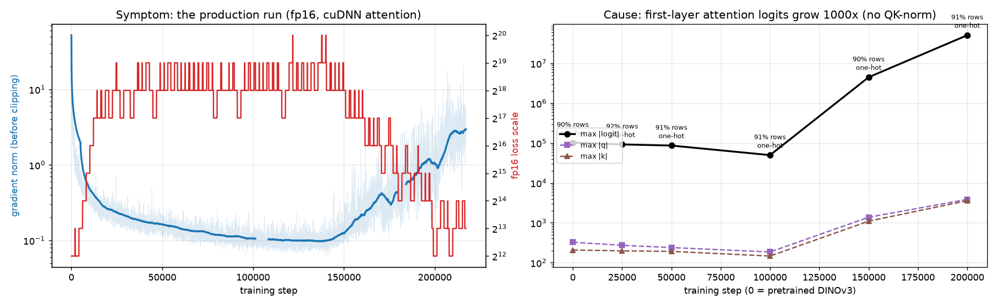

The first trunk layer's attention is a near-one-hot lookup already in the pretrained model
(logits ~1e5, 90% of rows over 99% on one key), and during training its q / k grew until the
logits reached 5e7. Comparing fp16 gradients with fp64 on the same weights and batch, module by
module in backward order, everything matched to cosine 0.999 down to that layer's attention
backward, where it fell to 0.05. Its real activations, run through every kernel:

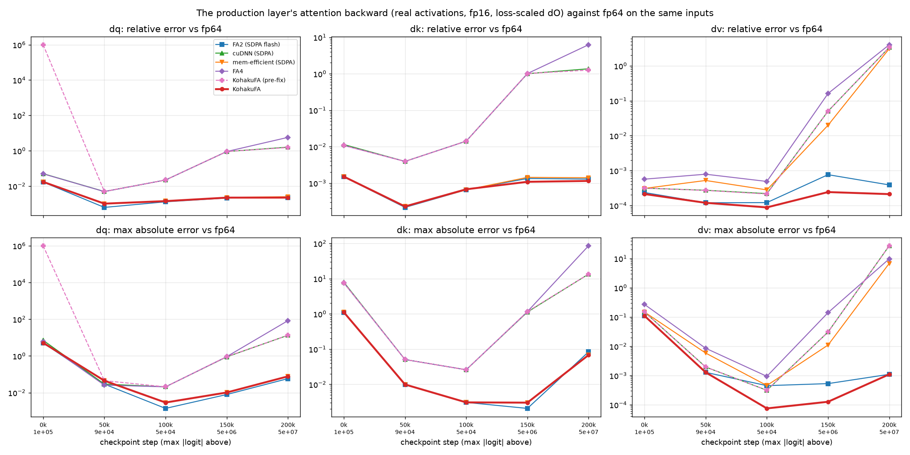

From the pretrained weights on, cuDNN and FA4 are 10 to 20x worse than FA2 / KohakuFA on dQ / dK;
past 4e6 they fail outright (relative error > 1). For the whole model, one training step's
gradient against fp64:

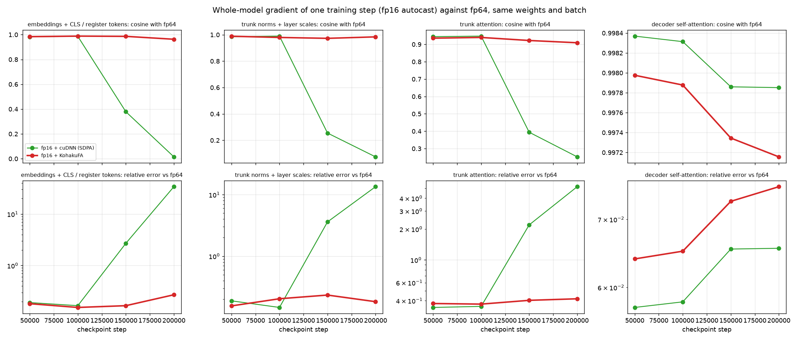

With cuDNN attention the embeddings' and trunk norms' gradients decorrelate from the truth
(cosine 0.01 at 200k, 34x too large); with KohakuFA they stay at the same agreement as at 50k.
Clipping then scaled *every* gradient by the inflated norm, and Adam turned the noise into
full-size steps on the very weights whose growth made it worse.

At the run's own attention call sites (effective TFLOPS, fwd and fwd+bwd):

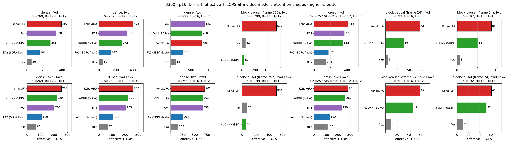

### On stock DINOv3 from the Hub, in fp16 and bf16

The production run is not a special setup. `benchmarks/dinov3_backward.py` takes the
**pretrained DINOv3 ViT-B/16 and ViT-L/16 from the Hugging Face Hub**, fine-tunes them on a toy
task (decode each patch token back to its RGB patch, 20k steps), and every 1k steps runs each
layer's real attention inputs through every kernel, against fp64 on the same rounded inputs:
fp16 with the run's live loss scale, and bf16 with none. Next to the kernels, fp64 emulations of
a correct kernel ("floor") and of each bug in [docs/precision.md](docs/precision.md) attribute
the error.

**Before a single training step**, the pretrained ViT-B/16's first attention layer (logits up to
1.4e5) already breaks FA4 and cuDNN, in both dtypes (relative L2 error vs fp64, worst layer;
the over-training figure is [at the top](#kohakufa)):

| | cuDNN (SDPA) | FA4 | mem-efficient (SDPA) | KohakuFA | floor (correct kernel) | emulated: scale before shift |
|---|---|---|---|---|---|---|
| fp16 dQ | 1.0e-1 | 1.0e-1 | 5.7e-3 | 5.7e-3 | 5.5e-3 | 1.3e-1 |
| fp16 dK | 5.4e-2 | 5.5e-2 | 2.2e-3 | 2.2e-3 | 2.1e-3 | 7.7e-2 |
| bf16 dQ | **8.8e-1** | **8.7e-1** | 3.1e-2 | 3.1e-2 | 3.1e-2 | 1.1 |
| bf16 dK | **5.0e-1** | **5.0e-1** | 9.5e-3 | 9.5e-3 | 9.3e-3 | 5.8e-1 |

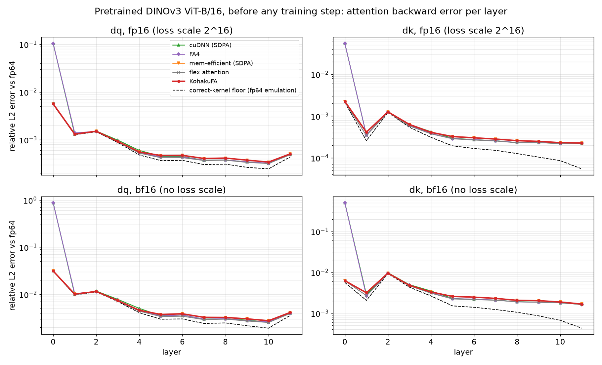

* **FA4 and cuDNN fail the same way**: over the 21 probes, their worst layer is 2.5 to 65x above
  the floor in fp16 and up to 54x in bf16, and the scale-before-shift emulation reproduces both
  (bug 2 in [docs/precision.md](docs/precision.md)). KohakuFA stays within 1.2x of the floor at
  most probes and at most 2.3x at a few, all in the near-one-hot layer 0, where the
  memory-efficient kernel shows the same excess to three digits (rounding the emulated floor
  leaves out, not a bug).
* **bf16 does not help: it makes this bug 10x worse.** bf16 has fp32's range, but rounds the
  row's largest probability (`2^residual` instead of exactly 1) to 8 bits instead of 11, so `O`
  and the backward's `delta = rowsum(dO * O)` are further off. Switching fp16 to bf16 hides
  nothing here; it trades one kernel bug's symptom for a larger error.
* The memory-efficient kernel is fine at these logits; its log-sum-exp bug (bug 1) needs logits
  past ~1e6, see [the synthetic sweep](#synthetic-sweep-where-each-kernel-breaks). It and cuDNN have a third, fp16-only bug
  (they round `scale * dS` instead of `dS`) that grows as fine-tuning shrinks the gradients at a
  moderate loss scale: 4 to 6x the floor on ViT-L/16 after 20k steps at 2^16
  ([figure](docs/images/dinov3_l_training_scale2e16.png), bug 3 in
  [docs/precision.md](docs/precision.md)).
* On ViT-L/16 the sharpest layer is milder (logits up to 3.4e4) and so is the damage: FA4 and
  cuDNN at 2 to 3x the floor in fp16, at the floor in bf16
  ([per layer](docs/images/dinov3_l_layers.png), [over training](docs/images/dinov3_l_training.png)).
* On this toy task the training loss is the same for every kernel and dtype
  ([ViT-B runs](docs/images/dinov3_b_runs.png), [ViT-L runs](docs/images/dinov3_l_runs.png)):
  20k steps of patch decoding are too easy for the wrong gradients to show in the loss. The
  production run above is where they did, after the trunk's logits grew to 5e7.

### Synthetic sweep: where each kernel breaks

Every kernel against **fp64 math on the same fp16 inputs**, so any difference is the kernel's
own error. Inputs are synthetic and seeded (`benchmarks/precision.py`): queries and keys around a
few shared directions, scaled so the largest logit sweeps 1e1 to 1e8; most rows are near one-hot
and some keys nearly tie, like an attention layer that learned a lookup.

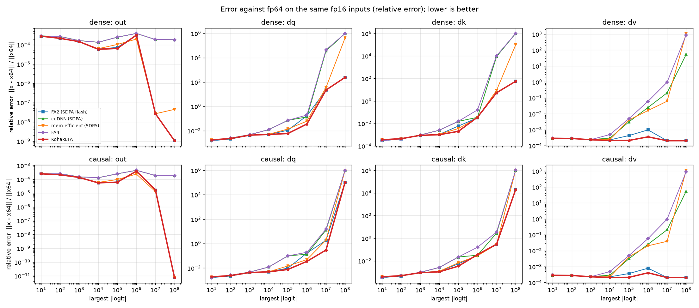

* **dV** shows the log-sum-exp bug in isolation: KohakuFA (and FA2) stay at the fp16 floor
  (~3e-4) up to 1e8, while FA4, cuDNN, flex and the memory-efficient kernel climb past 1 and reach
  1e3.
* **dQ / dK** are harder for *everyone*: above ~1e6 the gradient is genuinely ill-conditioned
  (near-tied keys with norms in the thousands make `dQ = sum_j dS_j k_j` cancel), and no fp16
  kernel is exact there, but KohakuFA degrades least: at 1e7, dQ relative error 0.3 against 3.5
  (cuDNN and flex), 4.2 (FA4) and 30 (FA2) on the tighter-cluster sweep
  ([precision_rel_err](docs/images/precision_rel_err.png)).
* The same sweep with max absolute error and with `1 - cosine` is in
  [precision_max_abs_err](docs/images/precision_max_abs_err_j3e-2.png) and
  [precision_one_minus_cos](docs/images/precision_one_minus_cos_j3e-2.png); per-row error
  distributions in [precision_rows](docs/images/precision_rows_j3e-2.png).

## Speed

B300, fp16, head dim 64, 16 heads, 32k tokens per call, timed inside CUDA graphs
(`benchmarks/speed.py`). Effective TFLOPS counts only the visible (unmasked) FLOPs.

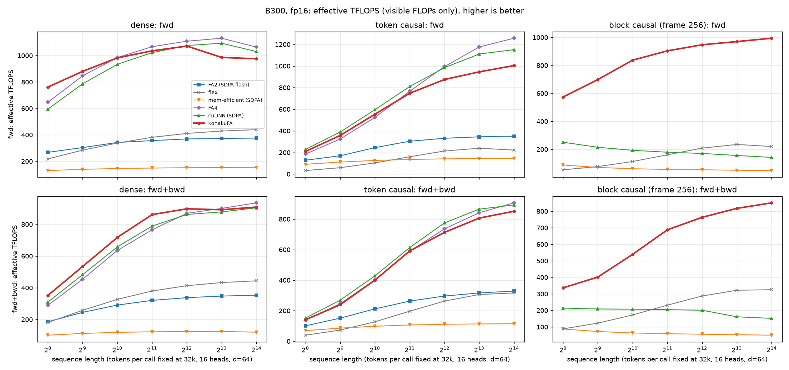

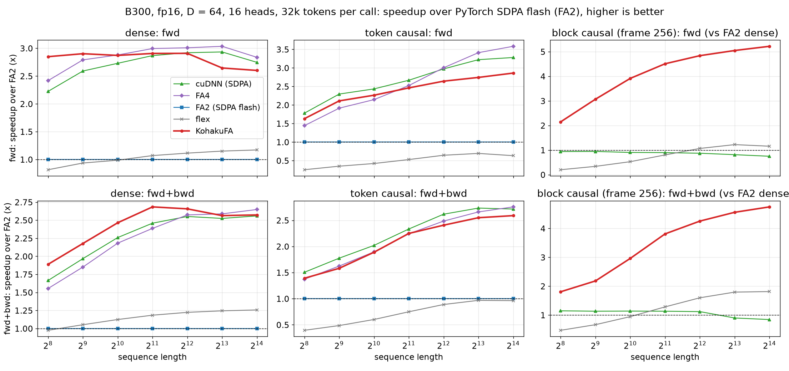

* **Dense:** fastest fwd+bwd up to 2k tokens (2.7x FA2 at 2k, vs 2.5x cuDNN and 2.4x FA4) and the
  fastest forward below 1k; at 8k to 16k on par with FA4 / cuDNN for fwd+bwd (2.57x vs 2.56x /
  2.65x at 16k) and ~10% behind them on the forward alone.
* **Token causal:** behind cuDNN and FA4: forward 8-9% up to 2k tokens, 14% at 4k and ~25% at
  8k to 16k; fwd+bwd 4 to 12%. See [known gaps](#known-gaps).
* **Block causal:** 1.8x to 4.7x FA2-dense; cuDNN with an explicit mask is at or below FA2,
  flex attention up to 1.8x. FA4's `mask_mod` + block-sparsity path is not shown: its forward is
  correct but its backward is wrong (dQ / dK / dV relative error 1.4 to 3.0).

### Beyond fp16 dense / causal

bf16, grouped-query attention, a key-padding boolean mask and packed variable-length
sequences (`benchmarks/features.py`), each against the kernels that support it:

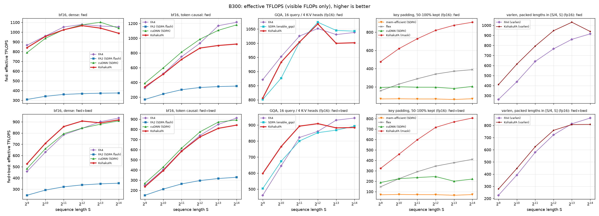

* **bf16:** dense on par with FA4 / cuDNN; token causal 5 to 20% behind at long lengths (the
  same diagonal-tile gap as fp16).
* **GQA (16 query / 4 K-V heads):** fastest fwd+bwd up to 2k (600 vs 500 TFLOPS at 512), on par
  with FA4 beyond.
* **Varlen:** faster than FA4's varlen forward at every length (1030 vs 855 TFLOPS at 8k);
  fwd+bwd ahead up to 4k and ~6% behind at 16k.
* **Boolean mask:** forward and backward skip hidden tiles and run fully visible ones unmasked
  (tile lists built when the mask is packed; `pack_mask` packs once for reuse across layers).
  Key padding at 16k: 927 TFLOPS forward and 815 TFLOPS fwd+bwd, against ~400 for flex
  attention's block mask and ~200 for cuDNN with a mask.

The precision sweep in bf16 is in [precision_rel_err (bf16)](docs/images/precision_rel_err_j3e-2_bf16.png):
the same picture as fp16, one step coarser.

### Head dims 64 to 512

Every head dim that is a multiple of 16 runs natively (others are zero-padded to one), up
to 512, forward and backward, at the same fp64-level precision. Wide heads change how
the work fits one SM:

* **forward**: above D = 128 a CTA holds one 128-row query half (O of a 512-column head
  would fill tensor memory alone), K / V stream through a ring of 64-column chunks, and
  at D = 512 the output's columns are split over two CTAs (QK^T computed by both);
* **backward**: above D = 128 a CTA owns one key tile and a <= 128-column slice of dK /
  dV / dQ (S^T and dP^T recomputed per slice), K resident and V / Q / dO streamed.

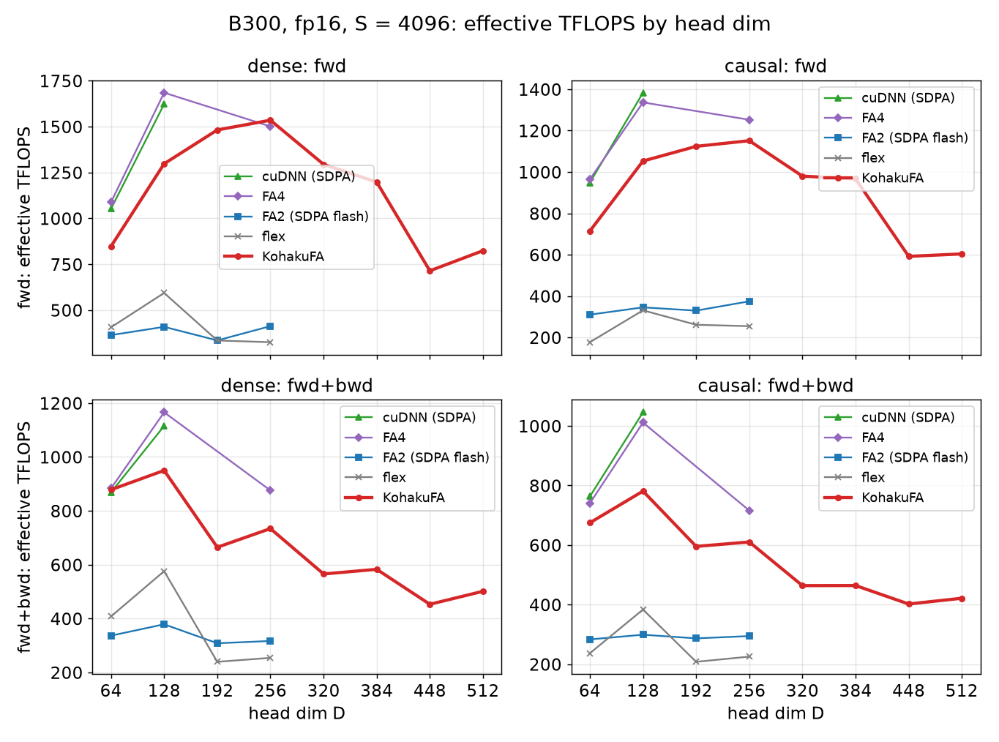

B300, fp16, 16k tokens, dense, effective TFLOPS (forward / backward):

| D | 64 | 128 | 192 | 256 | 320 | 384 | 448 | 512 |
|---|---|---|---|---|---|---|---|---|
| KohakuFA | 1070 / 1040 | 1413 / 980 | 1454 / 621 | 1448 / 730 | 1141 / 512 | 1139 / 521 | 911 / 457 | 694 / 455 |
| best other | FA4 1070 / 890 | FA4 1804 / 1157 | flex 377 / 234 | FA4 1431 / 906 | none runs | none | none | none |

FlashAttention-4 is faster at D = 128 (its forward skips most O rescales by letting the
row max lag, the source of its precision bug 2; its backward reduces dQ with a 1D bulk
copy Gluon does not expose) and in the D = 256 backward (2-CTA MMAs); see
[docs/performance-notes.md](docs/performance-notes.md). FA4 / cuDNN / FA2 do not run
D = 192 or D >= 320 on B300, and flex attention crashes there.

### Block sizes: planned, then timed

Each kernel has many legal configurations (key-tile width, S-ring depth, query halves,
value split, K / V ring depth, buffering, register split). `sm100/plan.py` scores every
legal one with a cost model calibrated from in-kernel clock traces (tensor-core,
shared-memory, MUFU, softmax, L2 and dQ-reduce terms, recomputation, waves);
`sm100/tune.py` times the best candidates of each structural family on the card,
interleaved, and keeps the winner per (architecture, head dim, masking, sequence-length
bucket). The tables tuned on B300 ship in `sm100/tuned/`; other shapes and cards use the
planner's best prediction. `python benchmarks/tune.py` re-tunes;
`kohakufa/device.py` describes a card and maps an architecture to its kernels (sm_120
plugs in there).

How well that works, on B300 at 32k tokens per call: every candidate below was timed in
one process, interleaved, from CUDA graphs. The wide sweep times the best 3 configurations of
every structural family (50 to 110 per shape) as a stand-in for the full space, and the
backward's whole space (12 to 20 configurations).

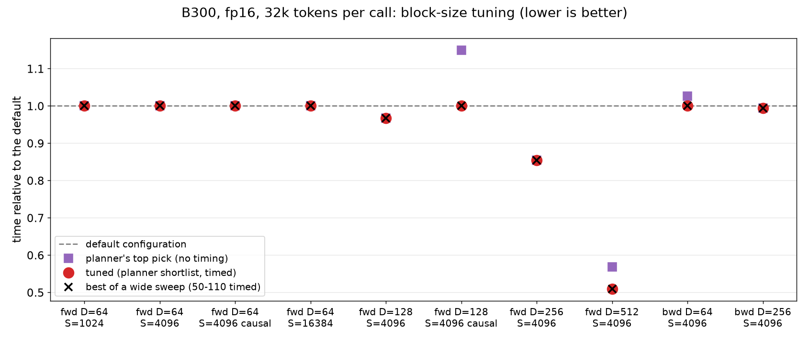

| shape | legal configs | timed by the tuner | default | tuned | wide sweep best | gain |
|---|---|---|---|---|---|---|
| fwd D=64, S=1k / 4k / 16k, 4k causal | 960 | 15 | - | = default | = default | 1.00x |
| fwd D=128, S=4096 | 1011 | 16 | 0.844 ms | 0.816 ms | 0.816 ms | 1.03x |
| fwd D=128, S=4096 causal | 1011 | 16 | 0.507 ms | 0.507 ms | 0.507 ms | 1.00x |
| fwd D=256, S=4096 | 589 | 16 | 1.680 ms | 1.435 ms | 1.435 ms | 1.17x |
| fwd D=512, S=4096 | 192 | 14 | 10.07 ms | 5.12 ms | 5.12 ms | 1.97x |
| bwd D=64 / D=256, S=4096 | 20 / 12 | all | 1.388 / 7.888 ms | 1.388 / 7.838 ms | (whole space) | 1.00x |

* The tuned pick matches the best of the wide sweep for every shape, timing 14 to 16 of up to
  ~1000 legal forward configurations. The planner's untimed top pick is the fastest in 6 of
  the 8 forward shapes; the misses (D = 128 causal, D = 512) are why a shortlist is timed.
* Gains come at wide heads, where a hand-written default cannot know the trade-offs; at
  D = 64 the hand-tuned default is already the best of 72 timed configurations.
* The shortlist is the 8 best predictions plus the best of each of the 8 best families, plus
  the default; spaces of up to 24 configurations are timed whole.

## Known gaps

Where KohakuFA is measurably slower than the fastest of FlashAttention-4 and cuDNN on B300
(time ratio, > 1 = slower), and why:

| case | forward | fwd+bwd | cause |
|---|---|---|---|
| token causal, D = 64, up to 2k tokens | 1.08-1.09 | 1.04-1.12 | wasted tile + masked diagonal (below) |
| token causal, D = 64, 8k to 16k tokens | 1.24-1.25 | 1.06-1.07 | the same, plus the long dense forward gap |
| dense, D = 64, 8k to 16k tokens | 1.09-1.15 | 1.01-1.03 | exact O rescale every key tile |
| D = 128, dense, 16k tokens | ~1.25 | ~1.2 | forward: exact rescale on the critical path; backward: dQ reduce |
| D = 256, dense, 16k tokens | 0.99 | ~1.2 (backward 1.24) | backward recomputes S / dP per output slice (FA4 uses 2-CTA MMAs) |

* **Token causal.** A forward CTA covers 256 query rows as two 128-row halves, and both halves
  walk the key tiles of the second half: the first half also computes the second half's
  diagonal key tile, which it cannot see (fully masked work, one wasted tile per 256 rows:
  ~20% of the work at 1k tokens, ~1.5% at 16k). Diagonal tiles also take the generic masked
  softmax path. Planned: a per-half key-tile count, and a token-causal diagonal fast path.
  The backward does not have the wasted tile (each key tile starts at its diagonal).
* **Exact rescaling.** The forward rescales O by exp2(m_old - m_new) after every key tile.
  FlashAttention-4 skips most rescales by letting the row max lag behind the true max, which
  is what makes its largest P differ from 1 and its gradients drift at large logits
  ([precision bug 2](docs/precision.md)). KohakuFA keeps the exact form; with two query halves
  per CTA it sits on the critical path, with one half the softmax warpgroup is the bound.
* **dQ accumulation.** The backward adds dQ partials with TMA tensor reduce-adds; FA4 uses a 1D
  bulk reduce that Gluon does not expose. Removing the reduce entirely would bring D = 128 to
  FA4's time.
* **Wide heads.** Above D = 128 the backward recomputes S and dP for each 128-column output
  slice (7 instead of 5 matrix products at D = 256, 11 at D = 512).

Details and the measurements behind each: [docs/performance-notes.md](docs/performance-notes.md).

## Install

```bash
pip install -e .            # from a checkout
# deps: torch >= 2.9, triton >= 3.7 (Gluon with Blackwell support)
```

Needs an sm_100+ GPU (B200 / B300; tested on B300). Optional extras: `.[dev]` (pytest, ruff,
black), `.[bench]` (matplotlib, numpy for the benchmark plots).

## Usage

```python
attention(q, k, v, *, causal=False, block_causal=0, scale=None, compute_dtype=None)
```

* `q`: `[B, H, Sq, D]`, `k` / `v`: `[B, H, Skv, D]`. Views of `[B, S, H, D]` projections work
  as is (any strides with a contiguous last dimension, 16-byte aligned); the output is a
  `[B, H, Sq, D]` view of `[B, Sq, H, D]` storage, so `out.transpose(1, 2).flatten(2)` is free.
* `causal`: query `r` sees keys `0..r` (top-left aligned when `Sq != Skv`; keys no query sees get
  zero gradient). Same as `block_causal=1`.
* `block_causal=P`: query `r` sees the keys of frames `0..r // P`.
* `compute_dtype`: tensor-core operand dtype; other input dtypes (e.g. fp32) are cast.

## Features

| | |
|---|---|
| dense, token causal, block causal, cross attention (`Sq != Skv`) | yes |
| fp16 and bf16 compute; fp32 inputs (cast) | yes |
| GQA / MQA (`k` / `v` with fewer heads) | yes |
| head dim 1 .. 512 (native at multiples of 16, others zero-padded) | yes ([head dims](#head-dims-64-to-512)) |
| `torch.compile`, CUDA graphs | yes |
| boolean mask (broadcastable `[B, H, Sq, Skv]`, empty rows -> 0) | yes (hidden tiles skipped) |
| variable length (packed sequences, `cu_seqlens`; no padding computed) | yes |
| block sizes: analytical planner + timed shortlist, tuned tables for B300 | yes ([block sizes](#block-sizes-planned-then-timed)) |
| token-causal fast path (per-half key count, diagonal tiles) | planned ([known gaps](#known-gaps)) |
| sm_120 | planned (`device.py` architecture slot) |

## Reproducing

```bash
pip install -e .[dev,bench]
pytest                                                 # correctness vs fp64
python benchmarks/precision.py --jitter 3e-2 --tag _j3e-2
python benchmarks/speed.py
python benchmarks/plot.py                              # -> docs/images
```

FlashAttention-4 is benchmarked when `flash_attn.cute` is importable. The production-case
figures come from summary CSVs in `benchmarks/results/production` (no weights or activations)
and `benchmarks/plot_production.py`. The stock-DINOv3 study (needs `transformers` and access to
the gated DINOv3 weights; any folder of natural images works as data):

```bash
python benchmarks/dinov3_backward.py --images <image folder> --model b --backend kohakufa --dtype fp16
python benchmarks/dinov3_backward.py --images <image folder> --model l --backend kohakufa --dtype fp16 \
    --fp16-scale 65536 --out benchmarks/results/dinov3_fixed16     # bug 3 at a fixed loss scale
python benchmarks/plot_dinov3.py --runs benchmarks/results/dinov3   # -> docs/images/dinov3_*
python benchmarks/plot_dinov3.py --runs benchmarks/results/dinov3_fixed16 \
    --results benchmarks/results/dinov3_fixed16 --tag _scale2e16
```

## License

Apache-2.0. See [LICENSE](LICENSE).
