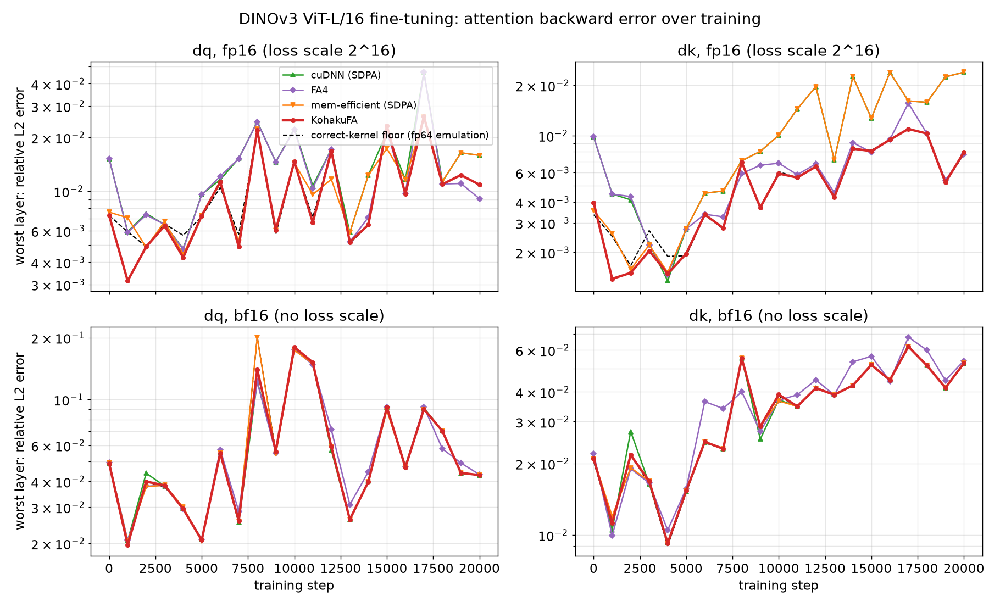

# Softmax precision in flash attention

Flash attention never stores the attention matrix `P`. The forward keeps a few numbers
per query row, and the backward **recomputes** `P` from the scores and those numbers. When
attention logits are ordinary (|logit| up to ~1e3) any reasonable bookkeeping works. When
a layer learns near-one-hot attention, logits reach 1e5 to 1e8, and fp32 itself starts to
run out of resolution: at |x| ~ 6e7 consecutive fp32 values are 4 apart. Two things then
go wrong in common implementations, and a third at any logit size in fp16, each silently, in
the **backward** only (the forward output stays correct, so the loss looks fine).

Notation: `S = q k^T` (raw scores), `c = scale * log2(e)`, `m` the row max, `l` the row
sum, `P = exp2(c (S - m)) / l`, `delta = rowsum(dO * O)`, `dS = P * (dP - delta)`.

## 1. One fp32 log-sum-exp per row

The usual forward saves `lse = c*m + log2(l)` as **one** fp32 number, and the backward
rebuilds `P = exp2(c*S - lse)`.

With `c*m ~ 6e7`, fp32 steps by 4, and `log2(l)` (between 0 and log2 of the key count,
so at most ~8 here) is mostly rounded away. The rebuilt `P` no longer sums to one: it is
off by up to `2^+-2` per row. `dV = P^T dO` is wrong directly, and `dS = P (dP - delta)`
stops cancelling, so `dQ` and `dK` blow up.

**Fix:** keep the two apart. The forward stores `m` (raw score units) and `log2(l)` as two
fp32 planes (`lse` is `[B, H, 2, Sq]`), and the backward rebuilds

```python
# sm100/bwd.py, P warpgroup: P^T = exp2(c (S^T - m) - log2 l)
x2 = float2.fma(s2 + m2, scale2, log_l2)  # m2 = -m, log_l2 = -log2(l)
prob = gl.exp2(float2.unpack(x2, axis=1))
```

Seen in: FlashAttention-4 (`flash_fwd_sm100.py`: `lse = (row_max*scale_log2 +
log2(row_sum)) * LN2`, then `flash_bwd_preprocess.py`: `lse_log2 = lse * LOG2_E`, then
`flash_bwd_sm100.py`: `exp2(fma(S, scale_log2, -lse_log2))`; two extra roundings), and
measured in PyTorch SDPA's cuDNN and memory-efficient backends (the latter even with
fp32 inputs), and in PyTorch flex attention (`flex_attention.py.jinja`: `lse = m_i +
tl.math.log2(l_i)`, one fp32 plane; on the synthetic sweep its dV error equals cuDNN's, 3.1e-3
at logits 1e5, 2.5e-2 at 1e6 and 0.21 at 1e7, against KohakuFA's 2e-4 to 4e-4).

## 2. Scaling before shifting

The usual forward computes the exponent as one fused multiply-add,
`fma(S, c, -c*m)`. `c*m` is rounded to fp32, so for the row's largest score the exponent
is not 0 but the rounding residual (up to +-2 at these magnitudes): the dominant `P` is
`2^residual`, not 1.

That alone is harmless for the forward (it cancels in `O / l`). But `P` goes through the
P.V tensor-core MMA in fp16 / bf16, and rounding a `P` of ~1.3 puts a 5e-4 relative
error on the dominant term of `O`. The backward's `delta = rowsum(dO * O)` is then off by
5e-4 of `|dO||V|`, while in a near-one-hot row the true `dP_j - delta` is tiny (it is
`sum_i P_i (dP_j - dP_i)` over the leftover probability mass). The rounding error
dominates and `dQ`, `dK` are wrong.

**Fix:** shift, then scale. `S - m` is exact near the row max (Sterbenz), so the dominant
`P` is exactly 1 and fp16 rounding only touches the small entries:

```python
# sm100/fwd.py, softmax step: m is the max of the raw scores
m_new = gl.maximum(m_i, row_max)
alpha = gl.exp2((m_i - m_new) * p.qk_scale)          # rescale of O and l
x2 = (float2.pack(chunks[c], axis=1) + neg_m2) * scale2  # (S - m) * c, not fma(S, c, -c m)
prob = gl.exp2(float2.unpack(x2, axis=1))
```

Cost: one extra packed f32x2 op per score in the forward and in the backward (about 5%
of attention time).

FlashAttention-4 uses `fma(S, scale_log2, max_offset - row_max*scale_log2)`
(`softmax.py`, `scale_subtract_rowmax`) and additionally lets the row max lag behind the
true max to skip rescales (`rescale_threshold`), so the dominant `P` is generally not 1.
Its preprocess has an opt-in fix for `delta` (`o_lo`, the rounding residual of `O`), but
it is only enabled on the sparse-MLA path. On its own it would not be enough: with the
scale-before-shift exponent, a more precise `O` is *inconsistent* with the `P` the backward
rebuilds, and in our emulation it made `dQ` / `dK` worse (cosine 0.35).

PyTorch flex attention has a milder form (`common.py.jinja`): it multiplies every score by the
scale and by `1 / ln 2` in fp32 first (`qk *= SM_SCALE`, `post_mod_scores *= RCP_LN2`), then
subtracts the max of the *scaled* scores. The row's largest `P` is still exactly 1, but every
score is rounded at its scaled magnitude before the shift, so near-tied keys with large logits
lose their difference. On the synthetic sweep (near-ties by design) its dQ / dK track cuDNN's
from logits of 1e4 up (dQ 7.2e-2 at 1e5, against 5.9e-3 for KohakuFA; in bf16 0.73 against
3.5e-2). The error depends on the sequence length: at multiples of its 128-token block (256, 1024,
4096) flex matches cuDNN, at every other length tested (257, 261, 1000, 1029, 2053, 4100) it is
accurate, so the bug is in the path it selects for divisible lengths (`IS_DIVISIBLE`).

## 3. Folding the softmax scale into dS before rounding it (fp16)

The `dQ = scale * dS K` and `dK = scale * dS^T Q` matmuls take `dS` as a 16-bit tensor-core
operand, so `dS` is rounded once in every kernel: that is the floor. Some kernels round
`scale * dS` instead, applying the softmax scale first. In fp16 that costs `log2(1 / scale)`
bits of range (3 bits at head dim 64): `dS` entries are already small (they carry
`P (dP - delta)`, and `dO` carries the loss scale), and the extra factor pushes more of them
below fp16's normal range (6e-5), where they lose precision or flush to zero.

It depends on the loss scale, which is why it is easy to miss: with the scaler high
(2^20 and up) the entries stay normal and every kernel is at the floor; at the scales a real
fp16 run often settles at (2^14 to 2^17, capped by the largest gradient anywhere in the
model) it is several times the floor, and it grows as fine-tuning shrinks the gradients. On
pretrained DINOv3 ViT-L/16 fine-tuned with a fixed 2^16 loss scale
(`benchmarks/dinov3_backward.py --fp16-scale 65536`), the worst layer's dK:



cuDNN and the memory-efficient kernel leave the floor as training goes and reach 4 to 6x it
by 20k steps (median over layers: dQ 8.9e-3 against 2.4e-3, dK 1.4e-2 against 2.3e-3; worst
layer dK 2.5e-2 against 7.9e-3); an fp64 emulation that rounds `scale * dS` to fp16 matches
them to three digits. FA4, flex attention and KohakuFA round `dS` and apply the scale in fp32
afterwards, and stay on the floor.

**Fix:** round `dS`, not `scale * dS`; apply the scale to the fp32 `dQ` / `dK` accumulators.

## bf16 does not make these go away

Bugs 1 and 2 come from fp32 arithmetic inside the kernel (the log-sum-exp, the exponent), not
from the 16-bit operand format, so they hit bf16 exactly as they hit fp16. Bug 2 is *worse* in
bf16: the row's largest `P` (`2^residual` instead of 1) is rounded to 8 bits instead of 11,
so the error on `O`, and on `delta`, is 8x larger. On the pretrained DINOv3 ViT-B/16, before
any training step (its first layer reaches logits of 1.4e5), the worst layer's dK relative
error against fp64:

| | cuDNN | FA4 | memory-efficient | KohakuFA | floor (correct kernel) |
|---|---|---|---|---|---|
| fp16 | 5.4e-2 | 5.5e-2 | 2.2e-3 | 2.2e-3 | 2.1e-3 |
| bf16 | 5.0e-1 | 5.0e-1 | 9.5e-3 | 9.5e-3 | 9.3e-3 |

Only bug 3 is fp16-specific (bf16 has fp32's exponent range, so `dS` does not underflow).
Moving a run from fp16 to bf16 can hide that one, while making bug 2 larger; "fp16 is
unstable, use bf16" mistakes a kernel bug for a number format.

## How it was found

A video model fine-tuning a pretrained DINOv3 ViT in fp16 showed a creeping gradient
norm and a falling fp16 loss scale in the second half of training, while the loss looked
normal. Comparing fp16 gradients with fp64 on the same weights and batch, module by
module in backward order, located the divergence inside the first trunk layer's
attention backward: every layer above it matched to cosine 0.999. That layer's attention
is near one-hot (pretrained DINOv3 already has logits ~1e5 there), and during training its
logits grew to 5e7. An emulation of the kernel's arithmetic in torch, toggling one
rounding at a time, isolated bugs 1 and 2 above. See the README's production case
for the plots.

A community member later hit the same large-logit, wrong-gradient behaviour with PyTorch flex
attention on an RTX PRO 6000 (cuDNN 9.10). We reproduced it on B300 with cuDNN 9.20: flex
shares bug 1 and the milder form of bug 2 described above (synthetic sweep, `precision.py`).

## Reproducing

* `benchmarks/precision.py`: synthetic sweep of logit magnitude, every kernel against
  fp64 on the same fp16 inputs (relative error, max absolute error, cosine, per-row
  error distributions).
* `tests/test_attention.py::test_huge_logits`: regression test for bugs 1 and 2.
* `benchmarks/dinov3_backward.py`: fine-tunes the pretrained DINOv3 ViT-B/16 or ViT-L/16
  from the Hugging Face Hub on a toy task and, every 1k steps, recomputes each layer's real
  attention backward with cuDNN, the memory-efficient kernel, FA4 and KohakuFA, in fp16 and
  bf16, against fp64, next to fp64 emulations of a correct kernel and of bugs 1, 2 and 3.
  `benchmarks/plot_dinov3.py` reduces the logs to `benchmarks/results/dinov3*/summary.csv`
  and draws the `docs/images/dinov3_*` figures.
